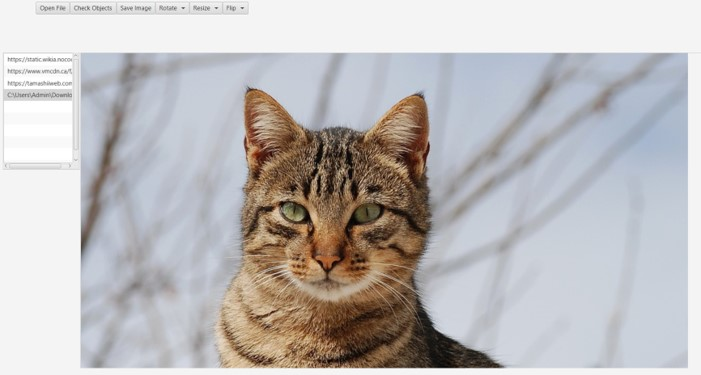
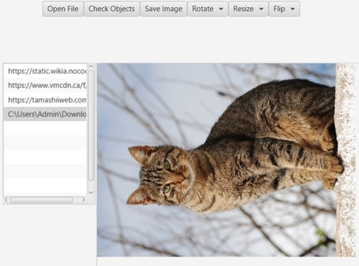
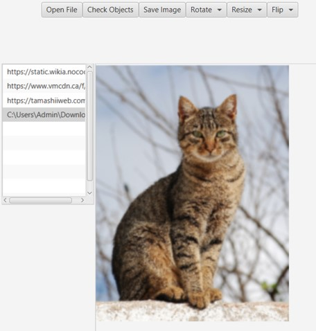
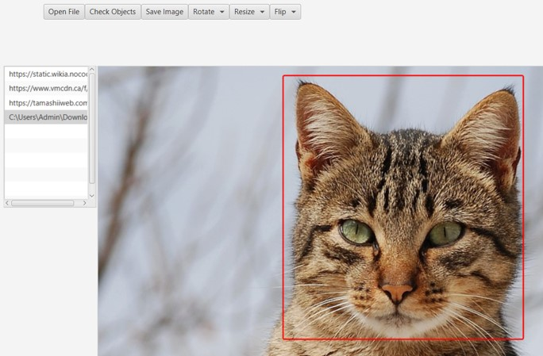
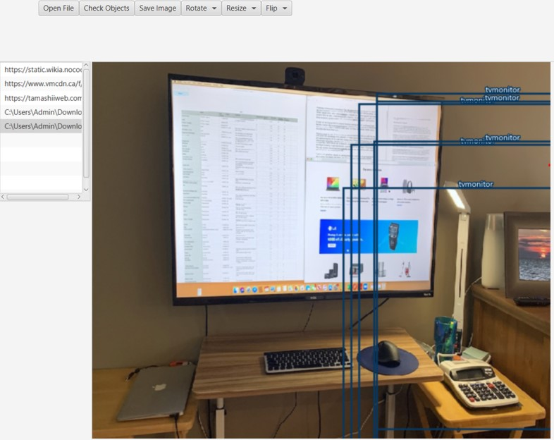

# ImageViewer
Simple JavaFX FXML application to view image

## Open & Save image
Using FileChooser to open and save image.
Application consists of:
<li>Buttons Area</li>
<li>Image Path Stored Area</li>
<li>Image View Area</li>

## Resize, Rotate, and Flip Image

## Crop Image

## Object Detection
Using TinyYOLO pretrained model to apply object detection task.
With 20 classes:

        
| Class  | 
| ------------- | 
| aeroplane  |
| bicycle |
| bird |
|boat|
|bottle|
|bus|
|car|
|cat|
|chair|
|cow|
|diningtable|
|dog|
|horse|
|motorbike|
|person|
|pottedplant|
|sheep|
|sofa|
|train|
|tvmonitor|

